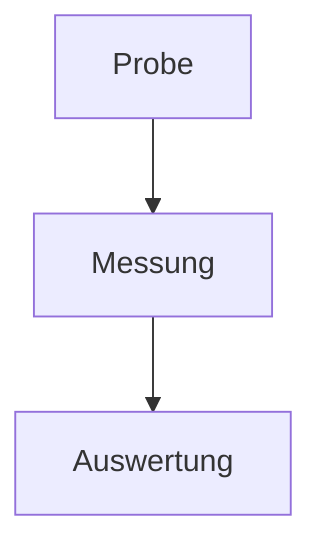

# make-paper — Subsystem B (render pipeline) Implementation Plan

> **For agentic workers:** REQUIRED SUB-SKILL: Use superpowers:subagent-driven-development (recommended) or superpowers:executing-plans to implement this plan task-by-task. Steps use checkbox (`- [ ]`) syntax for tracking.

**Goal:** Convert the German Markdown report produced by Subsystem A (`Papers/<name>.md`) into a styled academic **PDF** that imitates the project's sample document, using Pandoc + a custom LaTeX template + Tectonic, with Mermaid diagrams and existing vault images embedded.

**Architecture:** A deterministic Python pipeline (`render/render_paper.py` orchestrator + `render/preprocess.py` pure text transforms) preprocesses the report Markdown (strip manual heading numbers so LaTeX renumbers, pull out the title and abstract, resolve relative image paths against the project root, render ```` ```mermaid ```` blocks to PDF via `mmdc` and replace them with image links), prepends a YAML metadata block, then calls Pandoc with a custom single-column LaTeX template rendered by the Tectonic engine. Every transform is a pure, unit-tested function; the only external processes (`pandoc`, `tectonic`, `mmdc`) are injected so unit tests run without them, and two integration tasks exercise the real binaries.

**Tech Stack:** Python 3.14 (stdlib + pytest), Pandoc, Tectonic (XeTeX-based PDF engine), `@mermaid-js/mermaid-cli` (`mmdc`, via the installed Node), a custom Pandoc LaTeX template.

**Scope (locked):** v1 renders **tables (reliable) + Mermaid diagrams + existing vault images** in a **single-column** layout. Explicitly **deferred to v2**: auto-generated data charts, and faithful **two-column** reproduction (needs a tested longtable→`table*` Lua filter to survive LaTeX `twocolumn`). See "Deferred" at the end.

---

## File Structure

Repo root (existing, from Subsystem A): `C:\Users\il720506\.claude\make-paper\`.

- Create: `render/preprocess.py` — pure Markdown transforms (no external processes). One responsibility: massage the report Markdown into Pandoc-ready Markdown + extracted metadata.
- Create: `render/render_paper.py` — orchestrator + CLI: dependency check, Mermaid invocation wrapper, Pandoc command construction, the `render()` pipeline, `main()`.
- Create: `render/templates/paper.latex` — the custom Pandoc LaTeX template (single-column academic, German, Times-like).
- Create: `tests/test_preprocess.py` — pytest unit tests for the pure transforms.
- Create: `tests/test_render_paper.py` — pytest unit tests for orchestration (external processes mocked).
- Create: `tests/fixtures/report_de.md` — a realistic German report fixture for the end-to-end test.
- Modify: `README.md` — document Subsystem B usage + the A→B handoff command.

The `mmdc`-rendered diagrams and the processed Markdown are written under `<output_dir>/.render/` at runtime (already covered by the repo's `.gitignore`, which ignores `staging/`; this plan adds `.render/` to `.gitignore` in Task 1).

---

### Task 1: Subsystem-B scaffolding + dependency check

**Files:**
- Create: `render/render_paper.py`
- Create: `tests/test_render_paper.py`
- Modify: `C:\Users\il720506\.claude\make-paper\.gitignore`

- [ ] **Step 1: Create the render package directory**

Run (PowerShell):
```powershell
New-Item -ItemType Directory -Force "C:\Users\il720506\.claude\make-paper\render\templates" | Out-Null
New-Item -ItemType Directory -Force "C:\Users\il720506\.claude\make-paper\tests\fixtures" | Out-Null
```

- [ ] **Step 2: Add `.render/` to `.gitignore`**

Append a line to `C:\Users\il720506\.claude\make-paper\.gitignore` so the runtime work dir is never committed. The file currently ends with `staging/`; add:
```gitignore
.render/
```

- [ ] **Step 3: Write the failing test**

Create `tests/test_render_paper.py`:
```python
import sys
from pathlib import Path

sys.path.insert(0, str(Path(__file__).resolve().parents[1] / "render"))

import render_paper as rp


def test_check_dependencies_reports_missing():
    present = {"pandoc"}
    fake_which = lambda name: "/usr/bin/" + name if name in present else None
    missing = rp.check_dependencies(which=fake_which)
    assert missing == ["mmdc", "tectonic"]


def test_check_dependencies_none_missing():
    fake_which = lambda name: "/usr/bin/" + name
    assert rp.check_dependencies(which=fake_which) == []
```

- [ ] **Step 4: Run test to verify it fails**

Run:
```powershell
python -m pytest tests/test_render_paper.py -v
```
Expected: FAIL — `ModuleNotFoundError: No module named 'render_paper'`.

- [ ] **Step 5: Write minimal implementation**

Create `render/render_paper.py`:
```python
"""make-paper Subsystem B: render a German Markdown report into a styled PDF
via Pandoc + a custom LaTeX template (Tectonic engine), embedding Mermaid
diagrams and existing vault images."""
from __future__ import annotations

import shutil

REQUIRED_TOOLS = ["pandoc", "tectonic", "mmdc"]


def check_dependencies(which=shutil.which) -> list[str]:
    """Return the sorted list of REQUIRED_TOOLS not found on PATH."""
    return sorted(name for name in REQUIRED_TOOLS if which(name) is None)
```

- [ ] **Step 6: Run test to verify it passes**

Run:
```powershell
python -m pytest tests/test_render_paper.py -v
```
Expected: 2 passed.

- [ ] **Step 7: Commit**

```powershell
git -C "C:\Users\il720506\.claude\make-paper" add .gitignore render/render_paper.py tests/test_render_paper.py
git -C "C:\Users\il720506\.claude\make-paper" commit -m "feat(B): scaffolding + dependency check"
```

---

### Task 2: Install the render toolchain

This task installs the three external binaries the pipeline drives. It is an
environment task (no TDD); verify each tool reports a version, then confirm the
Task 1 dependency check sees them.

- [ ] **Step 1: Install Pandoc and Tectonic via winget**

Run (PowerShell):
```powershell
winget install --id JohnMacFarlane.Pandoc --accept-source-agreements --accept-package-agreements
winget install --id TectonicProject.Tectonic --accept-source-agreements --accept-package-agreements
```
If `winget` is unavailable, fall back to Scoop (`scoop install pandoc tectonic`) or
download Pandoc from https://pandoc.org/installing.html and Tectonic from
https://tectonic-typesetting.github.io/ and place both on PATH.

- [ ] **Step 2: Install the Mermaid CLI via npm (uses the installed Node)**

Run:
```powershell
npm install -g @mermaid-js/mermaid-cli
```
This provides the `mmdc` command. On first diagram render `mmdc` may download a
headless Chromium (Puppeteer); allow network access.

- [ ] **Step 3: Open a fresh shell and verify versions**

PATH changes from installers require a new shell. Run:
```powershell
pandoc --version | Select-Object -First 1
tectonic --version
mmdc --version
```
Expected: a Pandoc version (>= 3.0), a Tectonic version, and an `mmdc` version.

- [ ] **Step 4: Confirm the dependency check now passes**

Run:
```powershell
python -c "import sys; sys.path.insert(0, r'C:\Users\il720506\.claude\make-paper\render'); import render_paper as rp; print('missing:', rp.check_dependencies())"
```
Expected: `missing: []`.

- [ ] **Step 5: Note the outcome**

No commit (no repo files changed). Record in the run notes that pandoc, tectonic,
and mmdc are installed and on PATH. If any failed to install, STOP and resolve
before continuing — later integration tasks (10, 12) need all three.

---

### Task 3: Strip manual heading numbers

NotebookLM may emit headings like `## 2. Theoretische Grundlagen`. We strip the
leading number so Pandoc's `--number-sections` numbers them consistently (and so
nothing is double-numbered).

**Files:**
- Create: `render/preprocess.py`
- Test: `tests/test_preprocess.py`

- [ ] **Step 1: Write the failing test**

Create `tests/test_preprocess.py`:
```python
import sys
from pathlib import Path

sys.path.insert(0, str(Path(__file__).resolve().parents[1] / "render"))

import preprocess as pre


def test_strip_heading_numbers_removes_leading_numbers():
    md = "# Titel\n## 1. Einleitung\n### 2.3 Unterabschnitt\n## Fazit\nText 1. bleibt.\n"
    out = pre.strip_heading_numbers(md)
    assert "## Einleitung" in out
    assert "### Unterabschnitt" in out
    assert "## Fazit" in out
    assert "# Titel" in out
    # body text containing a number must be untouched
    assert "Text 1. bleibt." in out
```

- [ ] **Step 2: Run test to verify it fails**

Run:
```powershell
python -m pytest tests/test_preprocess.py -v
```
Expected: FAIL — `ModuleNotFoundError: No module named 'preprocess'`.

- [ ] **Step 3: Write minimal implementation**

Create `render/preprocess.py`:
```python
"""Pure Markdown transforms for make-paper Subsystem B. No external processes."""
from __future__ import annotations

import hashlib
import re
from pathlib import Path

_HEADING_NUM = re.compile(r"^(#{1,6})\s+\d+(?:\.\d+)*\.?\s+(.*\S)\s*$")


def strip_heading_numbers(md: str) -> str:
    """Remove a leading section number (e.g. '2.' or '2.3') from ATX headings."""
    out = []
    for line in md.splitlines():
        m = _HEADING_NUM.match(line)
        out.append(f"{m.group(1)} {m.group(2)}" if m else line)
    return "\n".join(out)
```

- [ ] **Step 4: Run test to verify it passes**

Run:
```powershell
python -m pytest tests/test_preprocess.py -v
```
Expected: 1 passed.

- [ ] **Step 5: Commit**

```powershell
git -C "C:\Users\il720506\.claude\make-paper" add render/preprocess.py tests/test_preprocess.py
git -C "C:\Users\il720506\.claude\make-paper" commit -m "feat(B): strip manual heading numbers"
```

---

### Task 4: Extract the title (first level-1 heading)

**Files:**
- Modify: `render/preprocess.py`
- Test: `tests/test_preprocess.py`

- [ ] **Step 1: Write the failing test**

Append to `tests/test_preprocess.py`:
```python
def test_extract_title_pulls_first_h1_and_removes_it():
    md = "# Mein Titel\n\n## Einleitung\nText\n"
    title, body = pre.extract_title(md)
    assert title == "Mein Titel"
    assert "# Mein Titel" not in body
    assert "## Einleitung" in body


def test_extract_title_ignores_h2_and_returns_none():
    md = "## Einleitung\nText\n"
    title, body = pre.extract_title(md)
    assert title is None
    assert body == md
```

- [ ] **Step 2: Run test to verify it fails**

Run:
```powershell
python -m pytest tests/test_preprocess.py -v
```
Expected: FAIL — no attribute `extract_title`.

- [ ] **Step 3: Write minimal implementation**

Add to `render/preprocess.py`:
```python
_H1 = re.compile(r"^#\s+(.*\S)\s*$")


def extract_title(md: str) -> tuple[str | None, str]:
    """Return (title, body_without_title). Title = first level-1 ATX heading."""
    lines = md.splitlines()
    for i, line in enumerate(lines):
        m = _H1.match(line)
        if m:
            del lines[i]
            return m.group(1), "\n".join(lines)
    return None, md
```

- [ ] **Step 4: Run test to verify it passes**

Run:
```powershell
python -m pytest tests/test_preprocess.py -v
```
Expected: 3 passed.

- [ ] **Step 5: Commit**

```powershell
git -C "C:\Users\il720506\.claude\make-paper" add render/preprocess.py tests/test_preprocess.py
git -C "C:\Users\il720506\.claude\make-paper" commit -m "feat(B): extract title"
```

---

### Task 5: Extract the abstract section

The sample places a full-width abstract before the body. We pull out a leading
section titled Abstract / Zusammenfassung / Kurzfassung so the template can render
it in an `abstract` environment.

**Files:**
- Modify: `render/preprocess.py`
- Test: `tests/test_preprocess.py`

- [ ] **Step 1: Write the failing test**

Append to `tests/test_preprocess.py`:
```python
def test_extract_abstract_pulls_named_section():
    md = (
        "## Zusammenfassung\n"
        "Dies ist die Kurzfassung.\n\n"
        "## Einleitung\n"
        "Der eigentliche Text.\n"
    )
    abstract, body = pre.extract_abstract(md)
    assert abstract == "Dies ist die Kurzfassung."
    assert "Zusammenfassung" not in body
    assert "## Einleitung" in body


def test_extract_abstract_returns_none_when_absent():
    md = "## Einleitung\nText\n"
    abstract, body = pre.extract_abstract(md)
    assert abstract is None
    assert body == md
```

- [ ] **Step 2: Run test to verify it fails**

Run:
```powershell
python -m pytest tests/test_preprocess.py -v
```
Expected: FAIL — no attribute `extract_abstract`.

- [ ] **Step 3: Write minimal implementation**

Add to `render/preprocess.py`:
```python
_HEADING = re.compile(r"^(#{1,6})\s+(.*\S)\s*$")
_ABSTRACT_TITLES = {"abstract", "zusammenfassung", "kurzfassung"}


def extract_abstract(md: str) -> tuple[str | None, str]:
    """Pull out a leading Abstract/Zusammenfassung/Kurzfassung section.

    Returns (abstract_text, body_without_that_section). The abstract spans from
    just after its heading to the next heading of the same or higher level.
    """
    lines = md.splitlines()
    start = level = None
    for i, line in enumerate(lines):
        m = _HEADING.match(line)
        if m and m.group(2).strip().lower() in _ABSTRACT_TITLES:
            start, level = i, len(m.group(1))
            break
    if start is None:
        return None, md
    end = len(lines)
    for j in range(start + 1, len(lines)):
        m = _HEADING.match(lines[j])
        if m and len(m.group(1)) <= level:
            end = j
            break
    abstract = "\n".join(lines[start + 1:end]).strip()
    body = "\n".join(lines[:start] + lines[end:]).strip("\n")
    return abstract, body
```

- [ ] **Step 4: Run test to verify it passes**

Run:
```powershell
python -m pytest tests/test_preprocess.py -v
```
Expected: 5 passed.

- [ ] **Step 5: Commit**

```powershell
git -C "C:\Users\il720506\.claude\make-paper" add render/preprocess.py tests/test_preprocess.py
git -C "C:\Users\il720506\.claude\make-paper" commit -m "feat(B): extract abstract section"
```

---

### Task 6: Resolve relative image paths against the project root

Any Markdown image whose target is a relative path is resolved against the project
root and rewritten to an absolute path so Pandoc/Tectonic can find it. URLs and
absolute paths are left alone; missing targets are reported (and left as-is so the
build still proceeds).

**Files:**
- Modify: `render/preprocess.py`
- Test: `tests/test_preprocess.py`

- [ ] **Step 1: Write the failing test**

Append to `tests/test_preprocess.py`:
```python
def test_resolve_images_rewrites_existing_relative_paths(tmp_path):
    (tmp_path / "img").mkdir()
    (tmp_path / "img" / "a.png").write_bytes(b"x")
    md = " und  und "
    out, missing = pre.resolve_images(md, tmp_path)
    assert (tmp_path / "img" / "a.png").as_posix() in out
    assert "img/missing.png" in out          # left untouched
    assert "https://x/y.png" in out          # URL untouched
    assert missing == ["img/missing.png"]
```

- [ ] **Step 2: Run test to verify it fails**

Run:
```powershell
python -m pytest tests/test_preprocess.py -v
```
Expected: FAIL — no attribute `resolve_images`.

- [ ] **Step 3: Write minimal implementation**

Add to `render/preprocess.py`:
```python
_IMG = re.compile(r"!\[([^\]]*)\]\(([^)]+)\)")


def resolve_images(md: str, project_root: Path) -> tuple[str, list[str]]:
    """Rewrite relative Markdown image targets to absolute project paths.

    Returns (rewritten_md, missing_targets). URLs and absolute paths are kept;
    missing relative targets are recorded and left unchanged.
    """
    missing: list[str] = []

    def repl(m: re.Match) -> str:
        alt, target = m.group(1), m.group(2).strip()
        if target.startswith(("http://", "https://")) or Path(target).is_absolute():
            return m.group(0)
        candidate = (project_root / target).resolve()
        if candidate.is_file():
            return f"})"
        missing.append(target)
        return m.group(0)

    return _IMG.sub(repl, md), missing
```

- [ ] **Step 4: Run test to verify it passes**

Run:
```powershell
python -m pytest tests/test_preprocess.py -v
```
Expected: 6 passed.

- [ ] **Step 5: Commit**

```powershell
git -C "C:\Users\il720506\.claude\make-paper" add render/preprocess.py tests/test_preprocess.py
git -C "C:\Users\il720506\.claude\make-paper" commit -m "feat(B): resolve relative image paths"
```

---

### Task 7: Render Mermaid blocks to images

Find ```` ```mermaid ```` fenced blocks, render each to a PDF via an injected
runner (so unit tests need no `mmdc`), and replace the block with an image link.
Files are named by a content hash for caching/determinism.

**Files:**
- Modify: `render/preprocess.py`
- Test: `tests/test_preprocess.py`

- [ ] **Step 1: Write the failing test**

Append to `tests/test_preprocess.py`:
```python
def test_iter_mermaid_blocks_returns_code():
    md = "Vor\n```mermaid\ngraph TD; A-->B\n```\nNach\n"
    assert pre.iter_mermaid_blocks(md) == ["graph TD; A-->B"]


def test_render_mermaid_blocks_replaces_with_image(tmp_path):
    md = "```mermaid\ngraph TD; A-->B\n```\n"
    calls = []

    def fake_runner(code, out_path):
        calls.append((code, out_path))
        Path(out_path).write_bytes(b"%PDF-fake")

    out = pre.render_mermaid_blocks(md, tmp_path / "figures", fake_runner)
    assert "```mermaid" not in out
    assert " == 1
    assert calls[0][0] == "graph TD; A-->B"
```

- [ ] **Step 2: Run test to verify it fails**

Run:
```powershell
python -m pytest tests/test_preprocess.py -v
```
Expected: FAIL — no attribute `iter_mermaid_blocks`.

- [ ] **Step 3: Write minimal implementation**

Add to `render/preprocess.py`:
```python
_MERMAID = re.compile(r"^```mermaid[ \t]*\n(.*?)\n```[ \t]*$", re.MULTILINE | re.DOTALL)


def iter_mermaid_blocks(md: str) -> list[str]:
    """Return the code body of each ```mermaid fenced block, in order."""
    return [m.group(1) for m in _MERMAID.finditer(md)]


def render_mermaid_blocks(md: str, out_dir: Path, runner) -> str:
    """Replace each ```mermaid block with an image link, rendering via `runner`.

    `runner(code: str, out_path: Path) -> None` produces an image file at out_path.
    """
    out_dir = Path(out_dir)
    out_dir.mkdir(parents=True, exist_ok=True)

    def repl(m: re.Match) -> str:
        code = m.group(1)
        digest = hashlib.sha1(code.encode("utf-8")).hexdigest()[:12]
        out_path = out_dir / f"mermaid-{digest}.pdf"
        runner(code, out_path)
        return f"})"

    return _MERMAID.sub(repl, md)
```

- [ ] **Step 4: Run test to verify it passes**

Run:
```powershell
python -m pytest tests/test_preprocess.py -v
```
Expected: 8 passed.

- [ ] **Step 5: Commit**

```powershell
git -C "C:\Users\il720506\.claude\make-paper" add render/preprocess.py tests/test_preprocess.py
git -C "C:\Users\il720506\.claude\make-paper" commit -m "feat(B): render mermaid blocks to images"
```

---

### Task 8: `mmdc` runner + Pandoc command construction

The real `mmdc` runner (used in integration) and the Pandoc argv builder. Both are
in `render_paper.py`; argv construction is pure and unit-tested, and the runner's
argv is tested via an injected `run`.

**Files:**
- Modify: `render/render_paper.py`
- Test: `tests/test_render_paper.py`

- [ ] **Step 1: Write the failing test**

Append to `tests/test_render_paper.py`:
```python
def test_build_pandoc_cmd_has_template_and_tectonic():
    cmd = rp.build_pandoc_cmd("in.md", "out.pdf", "tpl.latex", "/proj")
    assert cmd[0] == "pandoc"
    assert "in.md" in cmd
    assert "--template" in cmd and "tpl.latex" in cmd
    assert "--pdf-engine=tectonic" in cmd
    assert "--number-sections" in cmd
    assert "--resource-path=/proj" in cmd
    assert cmd[-2:] == ["-o", "out.pdf"]


def test_run_mmdc_invokes_mmdc_with_io(tmp_path):
    seen = {}

    def fake_run(argv, check):
        seen["argv"] = argv
        seen["check"] = check

    out = tmp_path / "d.pdf"
    rp.run_mmdc("graph TD; A-->B", out, run=fake_run)
    assert seen["argv"][0] == "mmdc"
    assert "-i" in seen["argv"] and "-o" in seen["argv"]
    assert str(out) in seen["argv"]
    assert seen["check"] is True
```

- [ ] **Step 2: Run test to verify it fails**

Run:
```powershell
python -m pytest tests/test_render_paper.py -v
```
Expected: FAIL — no attribute `build_pandoc_cmd`.

- [ ] **Step 3: Write minimal implementation**

Add to `render/render_paper.py` (add `import subprocess`, `import tempfile`, and
`from pathlib import Path` to the imports at the top):
```python
import subprocess
import tempfile
from pathlib import Path


def build_pandoc_cmd(input_path, output_path, template_path, resource_path) -> list[str]:
    """Construct the Pandoc argv for a single-column German PDF via Tectonic."""
    return [
        "pandoc",
        str(input_path),
        "--template", str(template_path),
        "--pdf-engine=tectonic",
        "--number-sections",
        f"--resource-path={resource_path}",
        "-o", str(output_path),
    ]


def run_mmdc(code: str, out_path, run=subprocess.run) -> None:
    """Render Mermaid `code` to `out_path` (PDF) using the mmdc CLI."""
    out_path = Path(out_path)
    with tempfile.NamedTemporaryFile(
        "w", suffix=".mmd", delete=False, encoding="utf-8"
    ) as f:
        f.write(code)
        src = Path(f.name)
    try:
        run(["mmdc", "-i", str(src), "-o", str(out_path), "-b", "transparent"], check=True)
    finally:
        src.unlink(missing_ok=True)
```

- [ ] **Step 4: Run test to verify it passes**

Run:
```powershell
python -m pytest tests/test_render_paper.py -v
```
Expected: 4 passed.

- [ ] **Step 5: Commit**

```powershell
git -C "C:\Users\il720506\.claude\make-paper" add render/render_paper.py tests/test_render_paper.py
git -C "C:\Users\il720506\.claude\make-paper" commit -m "feat(B): mmdc runner + pandoc command builder"
```

---

### Task 9: YAML front matter builder

Pandoc reads `title`, `author`, `abstract`, and a custom `dateline` from a YAML
metadata block. This builder emits a valid block, using a literal block scalar for
the (possibly multi-line) abstract.

**Files:**
- Modify: `render/preprocess.py`
- Test: `tests/test_preprocess.py`

- [ ] **Step 1: Write the failing test**

Append to `tests/test_preprocess.py`:
```python
def test_build_frontmatter_quotes_scalars_and_blocks_abstract():
    meta = {
        "title": 'Titel mit "Anführung"',
        "author": "Petr Nasybulin 478314, Philipp Gembruch 472685",
        "dateline": "RWTH Aachen, Juni 2026",
        "abstract": "Zeile eins.\nZeile zwei.",
    }
    fm = pre.build_frontmatter(meta)
    assert fm.startswith("---\n")
    assert fm.rstrip().endswith("---")
    assert 'title: "Titel mit \\"Anführung\\""' in fm
    assert "author: \"Petr Nasybulin 478314, Philipp Gembruch 472685\"" in fm
    assert "dateline: \"RWTH Aachen, Juni 2026\"" in fm
    assert "abstract: |" in fm
    assert "  Zeile eins." in fm
    assert "  Zeile zwei." in fm


def test_build_frontmatter_omits_empty_fields():
    fm = pre.build_frontmatter({"title": "T", "author": "", "dateline": "", "abstract": ""})
    assert "title:" in fm
    assert "author:" not in fm
    assert "abstract:" not in fm
```

- [ ] **Step 2: Run test to verify it fails**

Run:
```powershell
python -m pytest tests/test_preprocess.py -v
```
Expected: FAIL — no attribute `build_frontmatter`.

- [ ] **Step 3: Write minimal implementation**

Add to `render/preprocess.py`:
```python
def _yaml_scalar(value: str) -> str:
    """Double-quote a YAML scalar, escaping backslashes and quotes."""
    escaped = value.replace("\\", "\\\\").replace('"', '\\"')
    return f'"{escaped}"'


def build_frontmatter(meta: dict) -> str:
    """Build a Pandoc YAML metadata block from title/author/dateline/abstract.

    Empty fields are omitted; abstract uses a literal block scalar.
    """
    lines = ["---"]
    for key in ("title", "author", "dateline"):
        if meta.get(key):
            lines.append(f"{key}: {_yaml_scalar(meta[key])}")
    if meta.get("abstract"):
        lines.append("abstract: |")
        for ln in meta["abstract"].splitlines():
            lines.append("  " + ln)
    lines.append("---")
    lines.append("")
    return "\n".join(lines)
```

- [ ] **Step 4: Run test to verify it passes**

Run:
```powershell
python -m pytest tests/test_preprocess.py -v
```
Expected: 10 passed.

- [ ] **Step 5: Commit**

```powershell
git -C "C:\Users\il720506\.claude\make-paper" add render/preprocess.py tests/test_preprocess.py
git -C "C:\Users\il720506\.claude\make-paper" commit -m "feat(B): YAML front matter builder"
```

---

### Task 10: The LaTeX template + render smoke test

The custom Pandoc template (single-column, German via polyglossia, Times-like via
fontspec/TeX Gyre Termes, booktabs tables, graphics, abstract environment). A smoke
test renders a tiny document through the real Pandoc + Tectonic to prove the
template compiles. **Requires Task 2 binaries.**

**Files:**
- Create: `render/templates/paper.latex`
- Test: `tests/test_render_paper.py`

- [ ] **Step 1: Write the template**

Create `render/templates/paper.latex`:
```latex
\documentclass[a4paper,11pt]{article}

\usepackage{fontspec}
\setmainfont{TeX Gyre Termes}
\usepackage{polyglossia}
\setdefaultlanguage{german}

\usepackage{amsmath}
\usepackage{graphicx}
\usepackage{booktabs}
\usepackage{longtable}
\usepackage{array}
\usepackage{caption}
\usepackage[a4paper,margin=2.3cm]{geometry}
\usepackage[hidelinks]{hyperref}

% --- Pandoc compatibility shims ---
\providecommand{\tightlist}{%
  \setlength{\itemsep}{0pt}\setlength{\parskip}{0pt}}
\providecommand{\pandocbounded}[1]{#1}
$if(highlighting-macros)$
$highlighting-macros$
$endif$

\setlength{\parindent}{1em}
\captionsetup{font=small,labelfont=bf}

\title{$if(title)$$title$$else$\enspace$endif$}
\author{$if(author)$$author$$endif$$if(dateline)$ \\[2pt] \normalsize $dateline$$endif$}
\date{}

\begin{document}
\maketitle

$if(abstract)$
\begin{abstract}
$abstract$
\end{abstract}
$endif$

$body$

\end{document}
```

- [ ] **Step 2: Write the smoke test**

Append to `tests/test_render_paper.py`:
```python
import shutil
import subprocess
import pytest


pytestmark_integration = pytest.mark.skipif(
    rp.check_dependencies() != [],
    reason=f"missing tools: {rp.check_dependencies()}",
)


@pytest.mark.skipif(rp.check_dependencies() != [], reason="render toolchain not installed")
def test_template_compiles_minimal_doc(tmp_path):
    template = Path(rp.__file__).parent / "templates" / "paper.latex"
    md = tmp_path / "doc.md"
    md.write_text(
        '---\ntitle: "Test"\nauthor: "Max Mustermann"\n'
        'dateline: "RWTH Aachen, Juni 2026"\nabstract: |\n  Eine Kurzfassung.\n---\n\n'
        "# Abschnitt\n\nText mit Umlauten: äöü.\n\n"
        "| a | b |\n|---|---|\n| 1 | 2 |\n\nTabelle oben.\n",
        encoding="utf-8",
    )
    out = tmp_path / "doc.pdf"
    cmd = rp.build_pandoc_cmd(md, out, template, tmp_path)
    subprocess.run(cmd, check=True)
    assert out.is_file() and out.stat().st_size > 1000
```

- [ ] **Step 3: Run the smoke test**

Run:
```powershell
python -m pytest tests/test_render_paper.py -v -k template_compiles
```
Expected: PASS (PDF produced). First run may be slow while Tectonic downloads
packages. If it FAILS, read the Tectonic/LaTeX error, fix the template, and re-run
before committing. (If the toolchain is somehow not on PATH the test is skipped —
do not commit a skipped result as success; ensure Task 2 is complete.)

- [ ] **Step 4: Commit**

```powershell
git -C "C:\Users\il720506\.claude\make-paper" add render/templates/paper.latex tests/test_render_paper.py
git -C "C:\Users\il720506\.claude\make-paper" commit -m "feat(B): LaTeX template + render smoke test"
```

---

### Task 11: The `render()` orchestrator + CLI

Wire the pure transforms + Pandoc together. Orchestration is unit-tested with the
external `run` and the `mmdc` runner injected, so it needs no binaries.

**Files:**
- Modify: `render/render_paper.py`
- Test: `tests/test_render_paper.py`

- [ ] **Step 1: Write the failing test**

Append to `tests/test_render_paper.py`:
```python
def test_render_pipeline_writes_processed_md_and_calls_pandoc(tmp_path, monkeypatch):
    project = tmp_path / "proj"
    project.mkdir()
    report = project / "report.md"
    report.write_text(
        "# Mein Titel\n\n## Zusammenfassung\nKurz.\n\n## 1. Einleitung\nText.\n\n"
        "```mermaid\ngraph TD; A-->B\n```\n",
        encoding="utf-8",
    )
    calls = {}

    def fake_run(cmd, check):
        calls["cmd"] = cmd
        Path(cmd[cmd.index("-o") + 1]).write_bytes(b"%PDF-fake-output")

    def fake_mmdc(code, out_path):
        Path(out_path).write_bytes(b"%PDF-fake-diagram")

    out_pdf = project / "out.pdf"
    result = rp.render(
        report, out_pdf, project,
        title=None, authors="Max Mustermann", dateline="RWTH Aachen, Juni 2026",
        run=fake_run, mmdc_runner=fake_mmdc,
    )
    assert result == out_pdf
    # processed markdown was written with front matter + extracted title used
    processed = (project / ".render" / "processed.md").read_text(encoding="utf-8")
    assert 'title: "Mein Titel"' in processed
    assert 'author: "Max Mustermann"' in processed
    assert "abstract: |" in processed
    assert "## Einleitung" in processed       # number stripped
    assert "```mermaid" not in processed      # diagram replaced
    # pandoc was invoked to produce the output pdf
    assert calls["cmd"][0] == "pandoc"
    assert str(out_pdf) in calls["cmd"]


def test_main_errors_when_tools_missing(monkeypatch, tmp_path, capsys):
    monkeypatch.setattr(rp, "check_dependencies", lambda which=None: ["tectonic"])
    rc = rp.main([
        "--input", str(tmp_path / "r.md"),
        "--output", str(tmp_path / "o.pdf"),
        "--project", str(tmp_path),
    ])
    assert rc == 2
    assert "tectonic" in capsys.readouterr().err
```

- [ ] **Step 2: Run test to verify it fails**

Run:
```powershell
python -m pytest tests/test_render_paper.py -v -k "render_pipeline or main_errors"
```
Expected: FAIL — no attribute `render` / `main`.

- [ ] **Step 3: Write minimal implementation**

Add to `render/render_paper.py` (add `import argparse`, `import sys`, and
`import preprocess as pre` to the top imports):
```python
import argparse
import sys

import preprocess as pre


def render(input_md, output_pdf, project_root, *, title=None, authors=None,
           dateline=None, work_dir=None, run=subprocess.run, mmdc_runner=None) -> Path:
    """Full pipeline: preprocess the report Markdown and render it to a PDF."""
    input_md = Path(input_md)
    output_pdf = Path(output_pdf)
    project_root = Path(project_root)
    work_dir = Path(work_dir) if work_dir else output_pdf.parent / ".render"
    work_dir.mkdir(parents=True, exist_ok=True)

    md = input_md.read_text(encoding="utf-8")
    md = pre.strip_heading_numbers(md)
    extracted_title, md = pre.extract_title(md)
    abstract, md = pre.extract_abstract(md)
    md, _missing = pre.resolve_images(md, project_root)
    md = pre.render_mermaid_blocks(md, work_dir / "figures", mmdc_runner or run_mmdc)

    meta = {
        "title": title or extracted_title or "",
        "author": authors or "",
        "dateline": dateline or "",
        "abstract": abstract or "",
    }
    processed = pre.build_frontmatter(meta) + md
    processed_path = work_dir / "processed.md"
    processed_path.write_text(processed, encoding="utf-8")

    template = Path(__file__).parent / "templates" / "paper.latex"
    cmd = build_pandoc_cmd(processed_path, output_pdf, template, project_root)
    run(cmd, check=True)
    return output_pdf


def main(argv: list[str] | None = None) -> int:
    parser = argparse.ArgumentParser(description="make-paper Subsystem B renderer")
    parser.add_argument("--input", required=True, help="report Markdown from Subsystem A")
    parser.add_argument("--output", required=True, help="target PDF path")
    parser.add_argument("--project", required=True, help="project root (for images)")
    parser.add_argument("--title", help="override the title (else first H1)")
    parser.add_argument("--authors", help="author line, e.g. 'A 123, B 456'")
    parser.add_argument("--dateline", help="institution dateline, e.g. 'RWTH Aachen, Juni 2026'")
    args = parser.parse_args(argv)

    missing = check_dependencies()
    if missing:
        print(f"Missing tools: {', '.join(missing)}", file=sys.stderr)
        return 2

    out = render(
        args.input, args.output, args.project,
        title=args.title, authors=args.authors, dateline=args.dateline,
    )
    print(f"Wrote {out}")
    return 0


if __name__ == "__main__":
    raise SystemExit(main())
```

- [ ] **Step 4: Run test to verify it passes**

Run:
```powershell
python -m pytest tests/test_render_paper.py -v
```
Expected: all pass (the smoke test from Task 10 also runs; it requires the
toolchain — keep it green).

- [ ] **Step 5: Commit**

```powershell
git -C "C:\Users\il720506\.claude\make-paper" add render/render_paper.py tests/test_render_paper.py
git -C "C:\Users\il720506\.claude\make-paper" commit -m "feat(B): render orchestrator + CLI"
```

---

### Task 12: End-to-end integration render + README + handoff

A realistic German fixture exercises the whole real pipeline (Pandoc + Tectonic +
mmdc), then document Subsystem B usage and the A→B handoff. **Requires Task 2
binaries.**

**Files:**
- Create: `tests/fixtures/report_de.md`
- Test: `tests/test_render_paper.py`
- Modify: `README.md`

- [ ] **Step 1: Create the fixture**

Create `tests/fixtures/report_de.md`:
```markdown
# Quantitative Bestimmung des Extinktionskoeffizienten

## Zusammenfassung
Die Absorptionsspektroskopie erlaubt eine schnelle Konzentrationsbestimmung.
In dieser Arbeit wird der Extinktionskoeffizient bestimmt.

## 1. Einleitung
Farbe ist eine der ersten Eigenschaften einer Flüssigkeit. Ziel ist die
Bestimmung des Extinktionskoeffizienten $\alpha$.

## 2. Theorie
Das Lambert-Beersche Gesetz lautet $E = \alpha \cdot c \cdot l$.

## 3. Ergebnisse
Die Messwerte fasst die folgende Tabelle zusammen:

| c in l/l | I1 (Cts) | E     |
|----------|----------|-------|
| 0,2      | 1816     | 0,029 |
| 0,5      | 1644     | 0,072 |
| 1,0      | 1294     | 0,176 |

Der Ablauf der Messung:



## 4. Fazit
Der lineare Zusammenhang bestätigt das Lambert-Beersche Gesetz.

## Literaturverzeichnis
[1] RWTH Aachen: Versuchsanleitung SPE.
```

- [ ] **Step 2: Write the end-to-end test**

Append to `tests/test_render_paper.py` (add `import pypdf` — install it first with
`python -m pip install --quiet pypdf`):
```python
@pytest.mark.skipif(rp.check_dependencies() != [], reason="render toolchain not installed")
def test_end_to_end_render_real_pdf(tmp_path):
    import pypdf
    fixture = Path(__file__).parent / "fixtures" / "report_de.md"
    out = tmp_path / "paper.pdf"
    rp.render(
        fixture, out, tmp_path,
        authors="Petr Nasybulin 478314, Philipp Gembruch 472685",
        dateline="RWTH Aachen, Juni 2026",
    )
    assert out.is_file() and out.stat().st_size > 2000
    reader = pypdf.PdfReader(str(out))
    assert len(reader.pages) >= 1
    text = "".join((p.extract_text() or "") for p in reader.pages)
    assert "Extinktionskoeffizienten" in text
    assert "Lambert-Beersche" in text
```

- [ ] **Step 3: Run the end-to-end test**

Run:
```powershell
python -m pip install --quiet pypdf
python -m pytest tests/test_render_paper.py -v -k end_to_end
```
Expected: PASS — a multi-section German PDF is produced, the Mermaid diagram is
rendered and embedded, and the extracted text contains the expected terms. If it
fails, inspect the generated `<tmp>/.render/processed.md` and the Tectonic/mmdc
error output; fix and re-run before committing.

- [ ] **Step 4: Document usage + the A→B handoff in the README**

Append to `C:\Users\il720506\.claude\make-paper\README.md`:
```markdown

## Subsystem B — render to PDF

After Subsystem A writes `Papers/<name>.md`, render it to a styled PDF:

```powershell
python "$env:USERPROFILE\.claude\make-paper\render\render_paper.py" `
  --input  "<project>\Papers\<name>.md" `
  --output "<project>\Papers\<name>.pdf" `
  --project "<project>" `
  --authors "<author_names from A's manifest, comma-joined>" `
  --dateline "<dateline from A's manifest>"
```

Requires `pandoc`, `tectonic`, and `mmdc` on PATH (see install below). The renderer
strips manual heading numbers (LaTeX renumbers), lifts the title and abstract,
resolves relative image paths against the project, renders ```` ```mermaid ````
blocks via `mmdc`, and compiles a single-column German paper with Tectonic.

### Subsystem B install
```powershell
winget install JohnMacFarlane.Pandoc
winget install TectonicProject.Tectonic
npm install -g @mermaid-js/mermaid-cli
```

### Status / scope
v1: tables + Mermaid + existing images, single-column. Deferred to v2:
auto-generated data charts; faithful two-column layout (needs a longtable→table*
Lua filter to survive LaTeX twocolumn).
```

- [ ] **Step 5: Run the full suite**

Run:
```powershell
python -m pytest "C:\Users\il720506\.claude\make-paper\tests" -v
```
Expected: all Subsystem A tests (10) + all Subsystem B unit tests pass; the two
integration tests pass when the toolchain is installed.

- [ ] **Step 6: Commit**

```powershell
git -C "C:\Users\il720506\.claude\make-paper" add tests/fixtures/report_de.md tests/test_render_paper.py README.md
git -C "C:\Users\il720506\.claude\make-paper" commit -m "feat(B): end-to-end render test + README handoff"
```

---

## Self-Review

**Spec coverage (design spec subsystem B + revisions):**
- `.md → .pdf` clean interface → `render()` consumes A's `Papers/<name>.md`, writes `.pdf` (Task 11). ✓
- Pandoc + LaTeX render → `build_pandoc_cmd` + template + Tectonic (Tasks 8, 10). ✓
- LaTeX template carries fonts/layout/style derived from sample → single-column Times-like German template with title/author/dateline block, abstract env, German captions via polyglossia, booktabs tables (Task 10). ✓ (Two-column fidelity explicitly deferred — see below.)
- Mermaid diagrams (best-effort) → `render_mermaid_blocks` + `run_mmdc` (Tasks 7, 8) + embedded in E2E (Task 12). ✓
- Embed existing vault images → `resolve_images` resolves against project root, skips missing (Task 6). ✓
- Data-driven charts (existing data only) → **deferred to v2** by explicit decision (reliability-first); not invented. ✓ (documented)
- No invented data → renderer only transforms/embeds what A produced; no data synthesis anywhere. ✓
- Toolchain install (pandoc + LaTeX dist + Mermaid renderer) → Task 2; LaTeX dist = **Tectonic** (decision); Mermaid via Node `@mermaid-js/mermaid-cli`. ✓
- German output preserved → polyglossia `german` + fontspec Unicode; verified by Umlaut + term assertions (Tasks 10, 12). ✓
- Current-date German dateline → passed through from A's manifest via `--dateline`; B does not recompute it. ✓

**Placeholder scan:** No TODO/TBD; every code step shows complete code; template is complete; fixture is complete German Markdown. ✓

**Type/name consistency:** `preprocess` functions (`strip_heading_numbers`, `extract_title`, `extract_abstract`, `resolve_images`, `iter_mermaid_blocks`, `render_mermaid_blocks`, `build_frontmatter`, `_yaml_scalar`) and `render_paper` functions (`check_dependencies`, `build_pandoc_cmd`, `run_mmdc`, `render`, `main`) are referenced with matching signatures across tasks. `render()` injects `run` and `mmdc_runner` exactly as the orchestration test supplies them. Metadata keys (`title`, `author`, `dateline`, `abstract`) match between `build_frontmatter` and the template's `$title$`/`$author$`/`$dateline$`/`$abstract$` variables. ✓

**Integration-test honesty:** the two toolchain-dependent tests `skipif` when tools are absent — the plan states a skip is NOT a pass and requires Task 2 to be complete before claiming success. ✓

---

## Deferred to v2 (out of scope here)

- **Two-column layout** faithful to the sample. Blocker: Pandoc emits `longtable`
  for Markdown tables, which errors inside LaTeX `twocolumn` columns. Needs a
  tested Pandoc Lua filter converting tables to full-width `table*`/`tabular`
  floats (plus title/abstract via `\twocolumn[...]`).
- **Auto-generated data charts** from numeric tables (e.g. a ```` ```paperchart ````
  fenced-block → matplotlib filter), with a matching tweak to A's NotebookLM prompt
  so it emits chart specs from existing source data only.

## Cross-subsystem note (discovered during planning — affects Subsystem A, not B)

The real CLEAR vault stores authors at `Autors/autors.md` (folder "Autors", file
"autors.md") in the format `Name Matrikelnummer` per line followed by a dateline,
e.g. `Petr Nasybulin 478314`. Subsystem A's `resolve_assets` looks for
`Authors/authors.md`, and `parse_authors` expects `- ` bullet lines — so for CLEAR
it currently (a) misses the project file (wrong folder/file name) and falls back to
the global placeholder, and (b) even if found, would extract zero author names.
This is a Subsystem A correctness gap to fix separately (broaden the folder/file
match to `Aut(h)ors/aut(h)ors.md` and parse `Name <digits>` lines); B consumes the
author line as-is via `--authors`, so it is unaffected.
```
