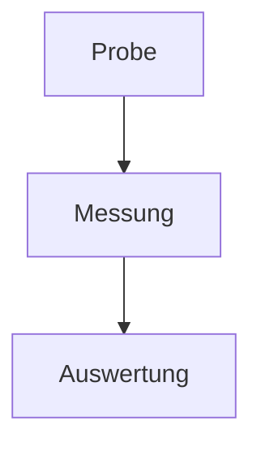

# Quantitative Bestimmung des Extinktionskoeffizienten

## Zusammenfassung
Die Absorptionsspektroskopie erlaubt eine schnelle Konzentrationsbestimmung.
In dieser Arbeit wird der Extinktionskoeffizient bestimmt.

## 1. Einleitung
Farbe ist eine der ersten Eigenschaften einer Flüssigkeit. Ziel ist die
Bestimmung des Extinktionskoeffizienten $\alpha$.

## 2. Theorie
Das Lambert-Beersche Gesetz lautet $E = \alpha \cdot c \cdot l$.

## 3. Ergebnisse
Die Messwerte fasst die folgende Tabelle zusammen:

| c in l/l | I1 (Cts) | E     |
|----------|----------|-------|
| 0,2      | 1816     | 0,029 |
| 0,5      | 1644     | 0,072 |
| 1,0      | 1294     | 0,176 |

Der Ablauf der Messung:

## 4. Fazit
Der lineare Zusammenhang bestätigt das Lambert-Beersche Gesetz.

## Literaturverzeichnis
[1] RWTH Aachen: Versuchsanleitung SPE.
